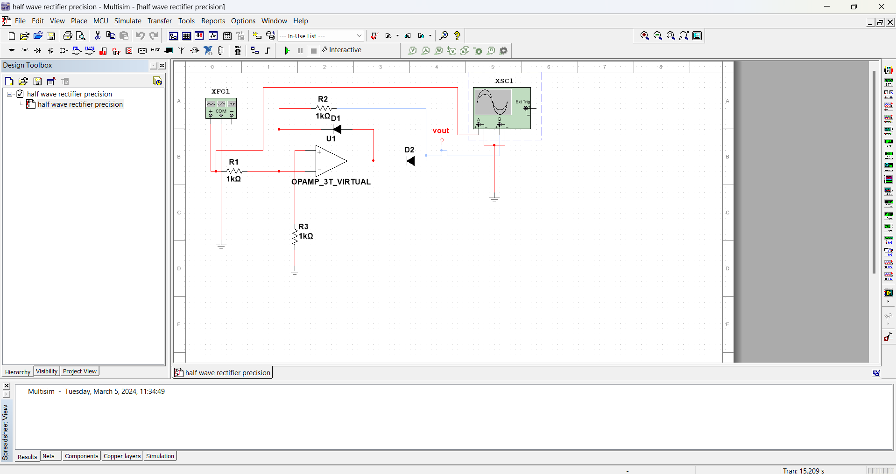

# Precision Half-Wave Rectifier

## Overview

This project implements a precision half-wave rectifier circuit using operational amplifiers. A precision half-wave rectifier is a circuit that rectifies only the positive half of an input signal while maintaining accuracy and linearity, often used in signal processing and instrumentation applications.

## Features

- Precision rectification of positive half-cycles of input signals
- Low distortion and offset errors
- Wide input voltage range
- High linearity and accuracy
- Simple and efficient circuit design

## Circuit Diagram

## Usage

1. **Components**: Gather the necessary components including operational amplifiers, resistors, and diodes as per the circuit diagram.

2. **Assembly**: Assemble the circuit on a breadboard or PCB following the circuit diagram provided.

3. **Testing**: Apply input signals of varying frequencies and amplitudes to test the performance of the rectifier circuit. Verify the output waveform using an oscilloscope or a multimeter.

4. **Adjustment**: Fine-tune resistor values or adjust potentiometers if necessary to optimize performance.

## Resources

- [Detailed Circuit Analysis](docs/circuit_analysis.pdf)
- [Datasheets for Components](docs/datasheets/)
- [Application Notes](docs/application_notes/)

## Contributing

Contributions to improve the circuit design, documentation, or additional resources are welcome. Please fork the repository, make your changes, and submit a pull request for review.

## License

This project is licensed under the MIT License - see the [LICENSE](LICENSE) file for details.

## Acknowledgements

Special thanks to [contributors' names or organizations] for their valuable input and feedback during the development of this project.
